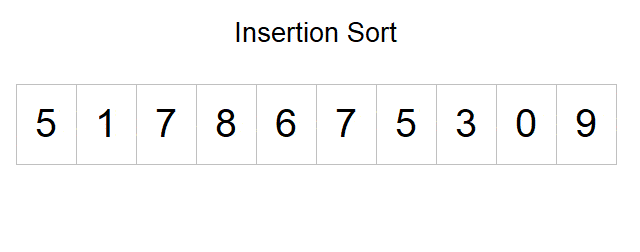

# **Insertion Sort**

<p>
Insertion sort is a simple sorting algorithm that works by iteratively inserting each element of an unsorted list into its correct position in a sorted portion of the list. It is a stable sorting algorithm, meaning that elements with equal values maintain their relative order in the sorted output.
</p>

<br/>
<br/>
<br/>

## Insertion Sort Visualization



<br/>
<br/>

## Insertion Sort Implementation

```
function InsertionSort(elements) {
  for (let i = 1; i < elements.length; i++) {
    let currentElement = elements[i];
    let j = i - 1;

    while (j >= 0 && currentElement < elements[j]) {
      elements[j + 1] = elements[j];
      j--;
    }
    elements[j + 1] = currentElement;
  }
  return elements;
}
```

_To achieve insertion sort, follow these steps:_

- We have to start with second element of the array as first element in the array is assumed to be sorted.
- Compare second element with the first element and check if the second element is smaller then swap them.
- Move to the third element and compare it with the second element, then the first element and swap as necessary to put it in the correct position among the first three elements.
- Continue this process, comparing each element with the ones before it and swapping as needed to place it in the correct position among the sorted elements.
- Repeat until the entire array is sorted.

<br />

### Time and Space Complexity

**Insertion Sort**: It performs well on small arrays or when the input array is nearly sorted.

| COMPLEXITY       | Base case | Average          | Worst            |
| ---------------- | --------- | ---------------- | ---------------- |
| Time Complexity  | O(N)      | O(n<sup>2</sup>) | O(n<sup>2</sup>) |
| Space Complexity | O(1)      | O(1)             | O(1)             |

<br />
