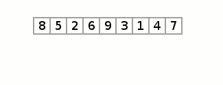

# **Selection Sort**

<p>
Selection sort is an effective and efficient sort algorithm based on comparison operations. It adds one element in each iteration. You need to select the smallest element in the array and move it to the beginning of the array by swapping with the front element
</p>

<br/>
<br/>
<br/>

## Selection Sort Visualization



<br/>
<br/>

## Selection Sort Implementation

```
function swap(elements, i, j) {
  [elements[i], elements[j]] = [elements[j], elements[i]];
}

function SelectionSort(elements) {
  for (let i = 0; i < elements.length - 1; i++) {
    let min_element_index = i;
    for (let j = i + 1; j < elements.length; j++) {
      if (elements[j] < elements[min_element_index]) {
        min_element_index = j;
      }
    }
    if (min_element_index !== i) {
      swap(elements, i, min_element_index);
    }
  }
  return elements;
}
```

_To achieve selection sort, follow these steps:_

Selection sort is a simple and efficient sorting algorithm that works by repeatedly selecting the smallest (or largest) element from the unsorted portion of the list and moving it to the sorted portion of the list.
<br />

### Time Complexity

**Selection Sort**: O(n^2).

<br />

### Space Complexity

O(1)

<br />

#### Advantages

- Simple and easy to understand.
- Works well with small datasets.

#### Disadvantages

- Selection sort has a time complexity of O(n^2) in the worst and average case.
- Does not work well on large datasets.
- Does not preserve the relative order of items with equal keys which means it is not stable.
